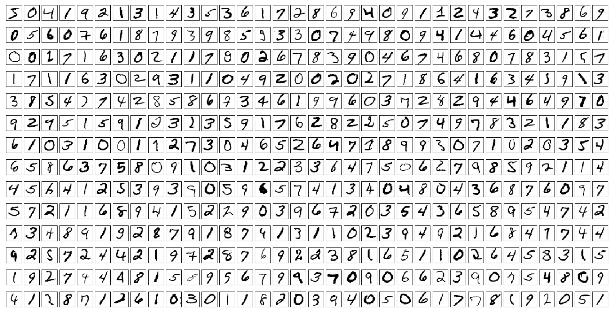

# mnist.py

This python module provides a function to _download_, _extract_ and _configure_ the MNIST database of handwritten digits that was created by Yann LeCun _et al_ for training and testing neural-networks. _The original dataset in [http://yann.lecun.com](http://yann.lecun.com/exdb/mnist/) has been removed._ Fortunately, they can still be obtained from [https://web.archive.org/](https://web.archive.org/web/20160828233817/http://yann.lecun.com/exdb/mnist/) and [Keras](https://storage.googleapis.com/tensorflow/tf-keras-datasets/mnist.npz). 

**Function:**

    load_MNIST(path=None, normalise=True, flatten=True, onehot=True)

_kwarg:_ 

    path - str: MNIST datasets directory. Default to current directory/MNIST.
                Create if nonexistant. Download any missing MNIST files.
    normalise - boolean: yes -> pixel RGB values [0,255] divided by 255.
                         no  -> pixel RGB values [0,255].
    flatten   - boolean: yes -> pixels of all images stored as 2D numpy array.
                         no  -> pixels of all images stored as 3D numpy array.
    onehot    - boolean: yes -> labels stored as one-hot encoded numpy array.
                         no  -> labels values used.

_Returns:_

    A dataklass called 'Mnist' with numpy.ndarray attributes called 
    'train_images', 'train_labels', 'test_images' and 'test_labels'.

    If normalise, the dtype of Mnist.train_images and Mnist.test_images are
    numpy.float64, else they will be numpy.uint8'

    If flatten, the shape of Mnist.train_images and Mnist.test_images is
    (60000, 784) and (10000, 784), respectively, else they will be
    (60000, 28, 28) and (10000, 28, 28), respectively.

    If onehot, the shape of Mnist.train_labels and Mnist.test_labels are
    (60000, 10) and (10000, 10), respectively, else they will be
    (60000,) and (10000,), respectively.

## How to use?

Step 1: Use either one of these import statements.

    from mnist_from_lecun import load_MNIST     # Import function from module
    from mnist_from_keras import load_MNIST     # Import function from module

Step 2: Run the function to get MNIST database, e.g.

    mdb = load_MNIST()                          # Default

Step 3: Access individual dataset like so:

    train_images = mdb.train_images             # A 60000x784 numpy array with float64 values    
    train_labels = mdb.train.labels             # A 60000x10 numpy array with uint8 values
    test_images = mdb.test_images               # A 10000x784 numpy array with float64 values    
    test_labels = mdb.test_labels               # A 10000x10 numpy array with uint8 values

## Dependencies:
1. numpy==2.2.2
2. requests==2.32.3

## Python Interpreter:
Python 3.13
